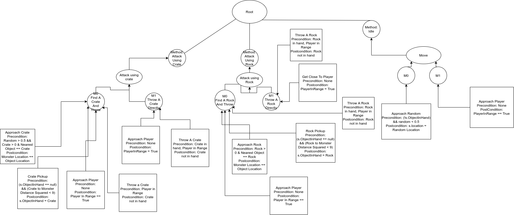

# HTN-Planning
COMP 521 A4 - HTN based AI



```
World State Vector:

treasurePickedUp : boolean value, set to true if player touched the treasure in monster's hive. Also turns the treasure yellow.
playerInRange : boolean value, set to true after ApproachPlayer()
nearestObject : Unity.GameObject, keeps track of the nearest Crate or Rock
ObjectInHand : Unity.GameObject, keeps track of the object in monster's hand
random : float between (0.0f, 1.0f), used to occasionally change into idle method 
crateCount : int, keeps track of the crates in the arena
hit : int, accumulate "hit count" for the projectile, hit++ when rock or crate landed on top of the player
randPos : Vector3, Random position in the arena, updated every 2 seconds. Used for ApproachRandom()
playerLocation : Vector3, keeps track of player's location
location : Vector3, keeps track of monster's location
```

